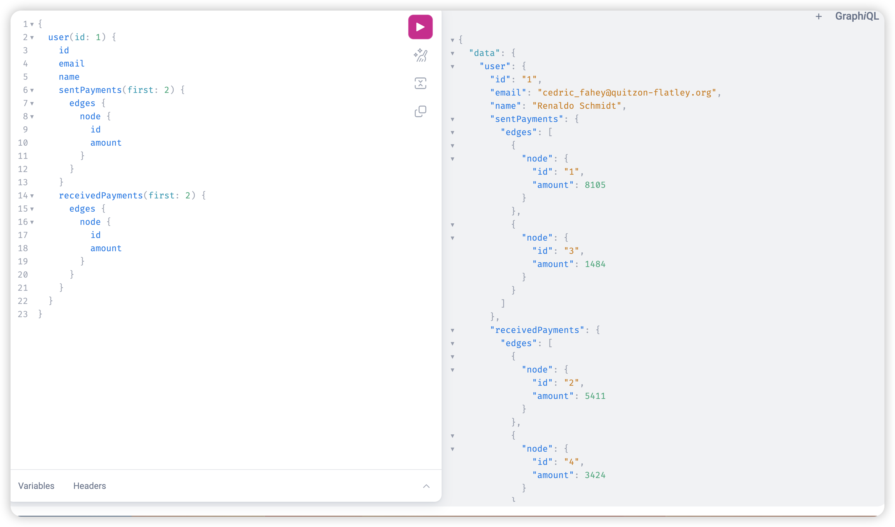

# Appollo Graphql solution

This project contains solution about building a payroll API solution with GraphQL and Ruby on Rails

## Description

This is a small project that demonstrates how to make a graphql queries using graphiql client api to get information from a graphql enpoint.




 


## Technologies

- Ruby on rails
- GraphQL
- RSpec

## Features
render my profile and job opportunities associated with my profile

## Usage
This project has not been deployed to production, heroku requires payment which I don't want to do now, hence can be used by setting it up locally.

> Clone the repository to your local machine

```sh
$ https://github.com/Forison/flexhire-test.git
```
> cd into the directory

```sh
$ bundle install
```

```sh
$ rails db:migrate
```

```sh
$ rails db:seed
```

```sh
$ rails s
```

Run test by running the command
Note not all test were covered due to time

```sh
$ rspec [spec path name here...]
```
Access graphiql from the endpoint

```sh
$ http://localhost:5000/graphiql
```
## Designed and developed by

[Boakye Addo Forison](https://github.com/Forison)

## Contact

[LinkedIn](https://www.linkedin.com/in/forison/)

## Contributing

1. Fork it (https://github.com/Forison/calculator/)
2. Create your feature branch (git checkout -b feature/[choose-a-name])
3. Commit your changes (git commit -am 'What this commit will fix/add')
4. Push to the branch (git push origin feature/[chosen name])
5. Create a new Pull Request